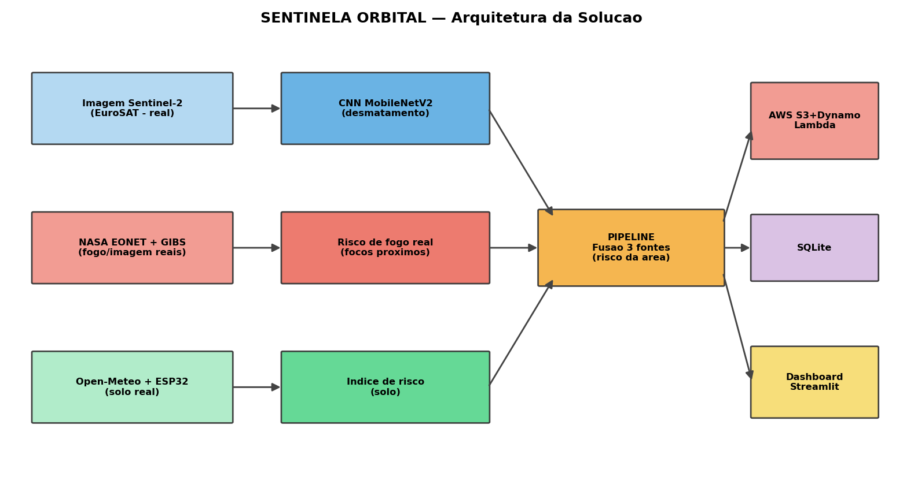
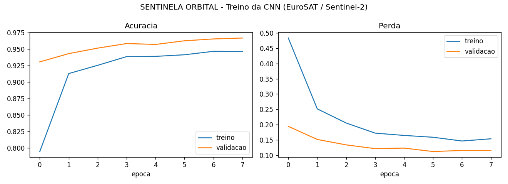
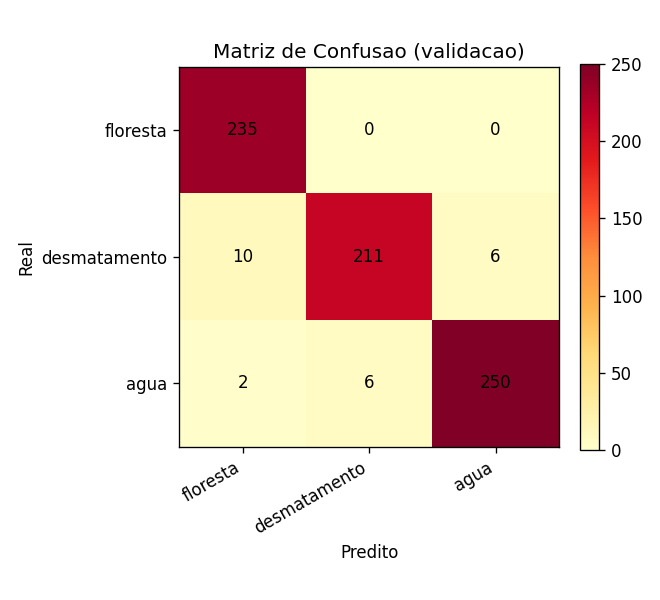
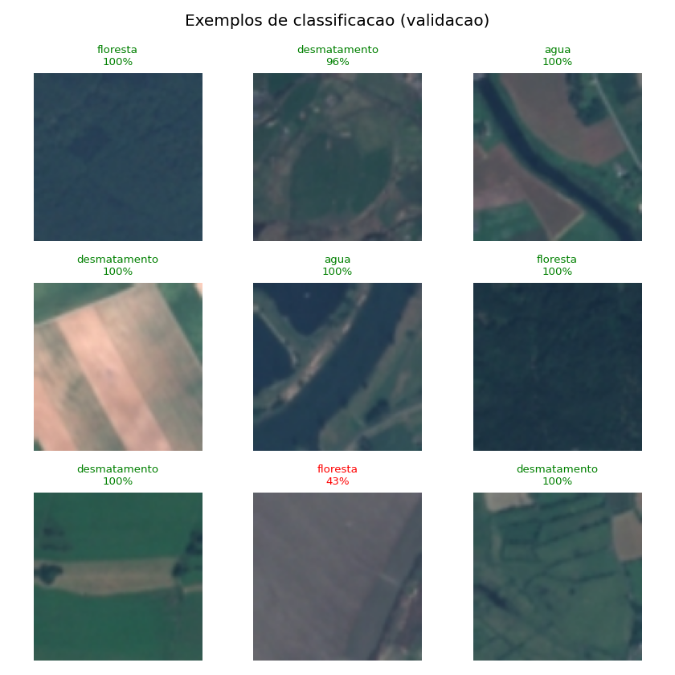
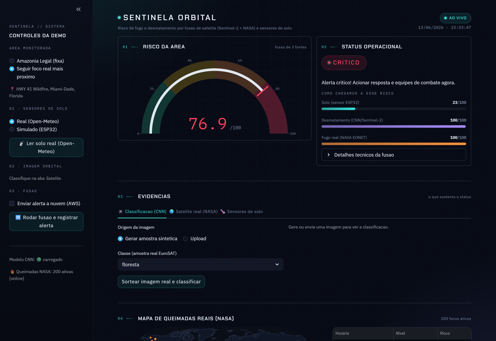
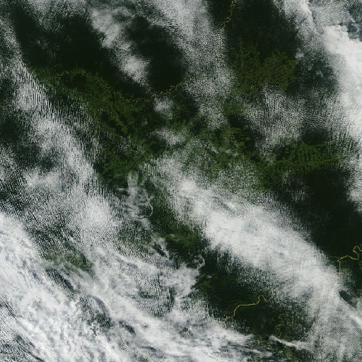

# SENTINELA ORBITAL — Relatório Técnico

**Monitoramento de desmatamento e queimadas com dados REAIS de satélite (Sentinel-2 / NASA), Visão Computacional, IoT (ESP32) e Computação em Nuvem (AWS).**

> FIAP — Graduação em Inteligência Artificial · **Sub Global Solution 2026.1**
> Nome: **Bruno de Souza Leite** — RM: **RM567213**

---

## 1. Introdução

A economia espacial é hoje uma das maiores oportunidades tecnológicas e estratégicas. Satélites de observação da Terra (constelação **Sentinel** / Copernicus, sensores **MODIS/VIIRS** da NASA) produzem diariamente um volume imenso de imagens e dados úteis para monitorar clima, agricultura e a integridade das florestas.

O **desmatamento** e as **queimadas** estão entre os problemas ambientais mais críticos do Brasil. Detectá-los cedo — combinando o que os satélites veem do espaço com o que sensores medem no solo — reduz perdas ambientais e econômicas.

O **SENTINELA ORBITAL** é uma POC que responde à pergunta da Sub GS 2026.1 usando **dados reais**: imagens reais de satélite, queimadas reais da NASA e sensores de solo, unidos por IA.

**Objetivo:** gerar, em tempo real, um nível de risco da área a partir da fusão de visão computacional (desmatamento), fogo real (NASA) e sensores de solo.

---

## 2. Desenvolvimento

### 2.1 Arquitetura (3 fontes)



1. **Imagem Sentinel-2** → CNN MobileNetV2 (transfer learning) → desmatamento.
2. **NASA EONET + GIBS** → queimadas reais + imagem de satélite real → risco de fogo.
3. **Open-Meteo (solo real)** + ESP32 → índice de risco do solo (temp/umidade do solo e CO reais).

Fusão ponderada → nível (BAIXO/MODERADO/ALTO/CRÍTICO) → SQLite + AWS → dashboard.

### 2.2 Visão Computacional — transfer learning com dados reais

A CNN usa **MobileNetV2** pré-treinada na ImageNet (base congelada) + cabeça densa para 3 classes. Treinada no **EuroSAT** (3.600 recortes RGB **reais** do Sentinel-2, 1.200/classe). Mapeamento: `desmatamento` = uso antrópico/agropecuária (AnnualCrop, Pasture, PermanentCrop), o principal vetor de desmatamento.

```python
base = MobileNetV2(input_shape=(IMG_SIZE, IMG_SIZE, 3),
                   include_top=False, weights="imagenet")
base.trainable = False
x = preprocess_input(inputs)
x = base(x, training=False)
x = GlobalAveragePooling2D()(x)
x = Dropout(0.3)(x)
out = Dense(n_classes, activation="softmax")(x)
```

**Acurácia de validação: ~96,7%** (realista para imagens de satélite reais). Sem internet, há *fallback* sintético offline.

### 2.3 Dados reais da NASA (sem chave de API)

- **EONET**: queimadas/incêndios ativos **reais** (coordenadas + data).
- **GIBS**: imagens de satélite **reais** (MODIS true-color) via WMS.

O risco de fogo (0–100) vem da proximidade/densidade das queimadas reais à área. Há cache e amostra de *fallback*.

### 2.4 IoT — sensores de solo (dados reais)

Leituras de solo **reais** via **Open-Meteo** (temperatura/umidade do solo, CO), sem chave de API. A mesma fórmula de risco roda sobre esses dados reais e no firmware ESP32 (`esp32_firmware.ino`) para hardware físico (simulador como *fallback*):

```python
risco = (0.28*f_temp + 0.22*f_seca_ar + 0.18*f_seca_solo
         + 0.24*f_fumaca + 0.08*f_temp_solo) * 100
```

### 2.5 Pipeline de fusão

```python
risco_total = (0.30*solo + 0.30*desmatamento + 0.40*fogo_real) / soma_pesos
```
Pesos renormalizados quando uma fonte falta.

### 2.6 Nuvem (AWS)

`aws_integration.py` envia imagem ao **S3** e alerta ao **DynamoDB**; `lambda_function.py` é o handler **serverless**. Sem credenciais → *fallback* local automático.

---

## 3. Resultados

CNN (MobileNetV2 + EuroSAT/Sentinel-2): **~96,7%** de acurácia de validação.





Dashboard: gauge de risco da área, 3 barras de origem (solo/desmatamento/fogo real), mapa com **queimadas reais da NASA**, imagem de satélite **real** (GIBS) e histórico de alertas.




---

## 4. Conclusões

O SENTINELA ORBITAL demonstra IA aplicada à economia espacial com **dados reais**: une o olhar do satélite (CNN sobre Sentinel-2), queimadas reais da NASA e sensores de solo em uma ferramenta de prevenção. Arquitetura modular e tolerante a falhas (fallbacks offline).

**Evoluções:** fine-tuning + datasets adicionais (FLAME, PRODES/INPE); segmentação U-Net; NASA FIRMS (VIIRS) + alertas via AWS SNS; AWS IoT Core (MQTT).

---

## 5. Links

- **Repositório:** https://github.com/souzaleite-dev/subgs
- **Vídeo (YouTube, Não Listado):** https://youtu.be/e5dnb7D5-fM

### Como executar
```bash
pip install -r requirements.txt
python -m src.ml.dataset_real        # baixa EuroSAT (Sentinel-2 real)
python -m src.ml.train               # treina CNN (transfer learning)
python scripts/gerar_dados_demo.py   # popula banco + fogo real NASA
streamlit run src/dashboard/app.py   # dashboard
```
